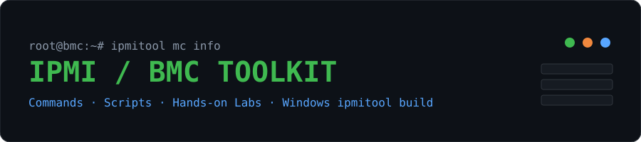

<p align="center"></p>

<p align="center">


</p>

# IPMI / BMC Server Management Toolkit

A practical collection of **IPMItool commands, ready-to-run scripts, hands-on labs and a Windows build of ipmitool** for troubleshooting Linux-based servers and data-center hardware through the BMC.

> **No server to practice on?** Open the dark-theme **[Interactive Practice Lab](https://github.com/kumar-narsaraju/ipmi-bmc-toolkit/blob/main/docs/index.html)** (simulated BMC, runs in your browser).

## Contents

- [What's Inside](#whats-inside) · [Quick Start](#quick-start) · [Connecting To A BMC](#connecting-to-a-bmc) · [Command Cheat Sheet](#command-cheat-sheet)
- [Hands-On Labs](#hands-on-labs) · [Scripts](#scripts) · [Troubleshooting](#troubleshooting) · [Security Notes](#security-notes) · [Verify Downloads](#verify-downloads) · [Licenses](#licenses)

## What's Inside

| Path | Purpose |
|------|---------|
| `windows/` | `ipmitool.exe`, `ipmievd.exe`, required Cygwin DLLs, checksums, and `bmc-health-check.ps1` |
| `scripts/` | Bash tools: health check, log collection, safe power control |
| `docs/` | Interactive practice lab (`index.html`) and the ipmitool manual (`ipmitool-manpage.txt`) |
| `assets/` | Banner image |

## Quick Start

### Windows (remote BMC access)

1. Click **Code → Download ZIP**, then extract it.
2. Open PowerShell inside the `windows` folder and check the tool runs:
   ```powershell
   .\ipmitool.exe -V
   .\ipmitool.exe -I lanplus -H 10.0.0.50 -U admin -a mc info
   ```
   `-a` asks for the password so it never appears in your command history. Keep all files in the `windows` folder together, because `ipmitool.exe` needs the `.dll` files next to it.
3. The Windows build talks to the BMC **over the network** (`-I lanplus`). Local in-band access (`-I open`) is for Linux.

### Linux

```bash
sudo apt install ipmitool          # Debian / Ubuntu
sudo dnf install ipmitool          # RHEL / Rocky / Alma
sudo modprobe ipmi_devintf ipmi_si # only for local (in-band) access
sudo ipmitool mc info              # local BMC
git clone https://github.com/kumar-narsaraju/ipmi-bmc-toolkit.git && cd ipmi-bmc-toolkit/scripts
```

## Connecting To A BMC

| Mode | Command pattern | Use when |
|------|-----------------|----------|
| Local (in-band) | `ipmitool <command>` | You are logged in to the server (Linux, root) |
| Remote IPMI 2.0 | `ipmitool -I lanplus -H <bmc-ip> -U <user> -a <command>` | Normal remote access (recommended) |
| Remote IPMI 1.5 | `ipmitool -I lan -H <bmc-ip> -U <user> -a <command>` | Only very old BMCs |

Password options: `-a` prompts, `-E` reads the `IPMI_PASSWORD` environment variable (best for scripts), `-P` puts it on the command line (avoid it, other users can see it).

## Command Cheat Sheet

| Task | Command |
|------|---------|
| BMC identity and firmware | `mc info` |
| BMC self-test | `mc selftest` |
| Reset BMC (server keeps running) | `mc reset warm` / `mc reset cold` |
| Power state | `chassis power status` |
| Power control | `chassis power on` · `off` · `soft` · `cycle` · `reset` |
| Blink the locator LED for 15 s | `chassis identify 15` |
| Next boot device | `chassis bootdev pxe` · `disk` · `bios` |
| All sensors with status | `sdr elist` |
| Only temperatures / fans / voltages | `sdr type Temperature` · `Fan` · `Voltage` |
| One sensor with thresholds | `sensor get "CPU1 Temp"` |
| Event log | `sel info` · `sel elist` · `sel clear` |
| Hardware inventory (serials, part numbers) | `fru print` |
| BMC network settings | `lan print 1` |
| BMC users | `user list 1` · `channel info 1` |
| Serial-over-LAN console | `sol activate` (exit with `~.`) · `sol deactivate` |
| Raw command (experts only) | `raw <netfn> <cmd> [data...]` |

The channel number (`1` above) is common but varies by vendor. If a command fails, try `2` or `3`. For GPU servers, `sdr type Temperature` is the quickest way to spot hot components.

## Hands-On Labs

Run these on a **test server** or in the [Practice Lab](https://kumar-narsaraju.github.io/ipmi-bmc-toolkit/). Each lab takes 5 minutes or less.

| # | Lab | Commands | What to look for |
|---|-----|----------|------------------|
| 1 | Talk to the BMC | `mc info` | `Device Available: yes`, `IPMI Version: 2.0`, firmware revision |
| 2 | Health snapshot | `chassis status`, `sdr elist` | Power state, and any sensor whose status is not `ok` |
| 3 | Find the hot spot | `sdr type Temperature`, `sdr type Fan`, `sensor get "<name>"` | Readings close to the upper critical threshold, or fans at 0 RPM |
| 4 | Read the event log | `sel info`, `sel elist > sel.txt` | Repeating events, power-loss or thermal entries, event timestamps |
| 5 | Build an inventory | `fru print > fru.txt` | Serial and part numbers (useful for RMA and vendor RCA) |
| 6 | Safe power cycle | `chassis identify 15`, `chassis power status`, `chassis power cycle` | Run it only on a test machine. Check `power status` and `sel elist` after boot |
| 7 | Audit BMC access | `lan print 1`, `user list 1` | No unused or default accounts, and a known IP and gateway |
| 8 | Reach the console | `sol info`, `sol activate` | Boot messages appear. Exit with `~.` |

## Scripts

All Bash scripts use the same variables. Leave `BMC_HOST` empty to use the local BMC.

```bash
export BMC_HOST=10.0.0.50 BMC_USER=admin
read -rs -p "BMC password: " IPMI_PASSWORD; export IPMI_PASSWORD

./scripts/bmc-health-check.sh        # identity, power, bad sensors, temps, fans, last events
./scripts/collect-logs.sh            # saves a timestamped .tar.gz of BMC data for support / RCA
./scripts/power-control.sh status    # status | on | off | soft | cycle | reset (asks for confirmation)
```

Windows: `powershell -ExecutionPolicy Bypass -File .\windows\bmc-health-check.ps1 -BmcHost 10.0.0.50 -User admin`

## Troubleshooting

| Message | Likely cause | Fix |
|---------|--------------|-----|
| `Could not open device at /dev/ipmi0` | IPMI kernel modules not loaded | `sudo modprobe ipmi_devintf ipmi_si` (local access, Linux) |
| `Error: Unable to establish IPMI v2 / RMCP+ session` | Wrong user or password, IPMI-over-LAN disabled, or cipher mismatch | Check credentials, try `-C 3` or `-C 17`, and confirm IPMI over LAN is enabled in the BMC |
| `Get Auth Capabilities error` | BMC not reachable | Check the IP, VLAN, and that UDP port **623** is allowed |
| `Insufficient privilege level` | User role too low | Use an ADMIN user, or add `-L ADMIN` |
| `Error in open session response message : no matching cipher suite` | Cipher not allowed | Try `-C 17`, or enable a modern cipher on the BMC |
| Commands hang | BMC busy or overloaded | Wait, then `mc reset cold` using a working session |
| Sensor shows `ns` | Sensor not present or not scanned | Normal for empty slots; not an error |

## Security Notes

- IPMI has known weaknesses. Keep BMCs on an **isolated management network**, never on the open internet.
- Use strong, unique BMC passwords, remove unused accounts, and disable **cipher suite 0** if your BMC allows it.
- Prefer `-a` or `-E` over `-P` so passwords stay out of shell history and process lists.
- The bundled Windows build uses an **old OpenSSL (1.0.2d, 2015)**, which is no longer maintained. Use it only on trusted lab networks. For production use, install the current `ipmitool` package from your OS vendor.
- Only manage systems you are **authorized** to manage. Power commands interrupt running workloads.

## Verify Downloads

SHA-256 checksums for every bundled binary are in [`windows/SHA256SUMS.txt`](windows/SHA256SUMS.txt). Check them in PowerShell:

```powershell
cd windows; Get-FileHash *.exe, *.dll -Algorithm SHA256
```

## Licenses

Scripts, docs and the lab page are under this repository's **GPL-3.0** license. The Windows binaries are third-party software with their own licenses, listed in [`THIRD-PARTY-NOTICES.md`](THIRD-PARTY-NOTICES.md).

## Author

**Kumar Narsaraju** · Systems Engineer, data center and GPU server infrastructure
[LinkedIn](https://www.linkedin.com/in/kumar-narsaraju-71478928a/) · [GitHub](https://github.com/kumar-narsaraju) · [Portfolio](https://kumar-narsaraju.github.io)

Provided as-is, without warranty. Test on non-production systems first.
